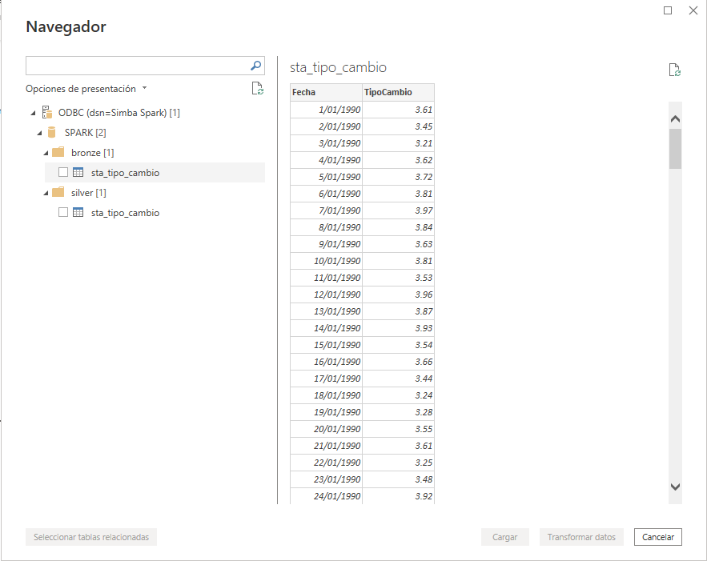

# Data Platform - Caja Huancayo

## 0. Requisitos

- Docker Engine (o Docker Desktop en Windows y Mac)
- PowerBI
- SimbaSparkODBC (Driver ODBC distribuido por Databricks)
- Descargar https://repo1.maven.org/maven2/com/amazonaws/aws-java-sdk-bundle/1.12.262/aws-java-sdk-bundle-1.12.262.jar
- Copiar el JAR en la ruta spark/jars

## 1. Preparar red virtual y ejecutar docker compose

```bash
docker network create data_services
docker compose up -d
```

## 2. Instalar ODBC Driver

- Descomprime e instala el contenido de: **SimbaSparkODBC-2.9.1.1001-Windows-64bit.zip**
- Dirigirse a **Orígenes de datos ODBC (64-bits)**
- En la pestaña **DSN de usuario** , agregar un nuevo origen de datos
- Seleccionar Simba Spark ODBC Driver y completa con la siguiente informacion:
  - Data Source Name: Spark Thrift
  - Spark Server Type: SparkThriftServer (Spark 1.1. and later)
  - Service Discovery Mode: No Service Discovery
  - Host(s): localhost
  - Port: 10000
  - Database: default
  - Authentication
    - Mechanism: User Name
    - User Name: hive
    - Thrift Transport: SASL
  
> Si da un error relacionado a SSL, ve a **SSL Options...** y deshabilitalo

## 3. Conexión a Spark desde PowerBI

- Crea un nuevo informe
- Clic en Obtener datos -> Más...
- Escribe ODBC
- Selecciona  el DSN: **Spark Thrift**
- En opciones avanzadas: Escribe la query que necesitas

NOTA: Si no pasas una query, el conector listará una vista jerárquica de las tablas existentes.
Para las tablas que sean de tipo PARQUET, se podrá visualizar una vista previa. Sin embargo para las tablas Delta, dará un error. Por ello, si se consumirá tablas Delta, la consulta SQL es la manera recomendada.



## 4. Uso del servicio PySpark
Es un entorno de JupyterLab con Pyspark cargado. Incluye ademas librerias como pymssql, delta-lake, boto3 y spark-sql
que facilitaran el desarrollo, interaccion y creación de fuentes de datos con Spark 3.5.0

Desde PySpark puedes conectarte a:

- SQL Server con las siguientes credenciales:
  - "user": "SA",
  - "password": "YourStrong@Passw0rd",
  - "driver": "com.microsoft.sqlserver.jdbc.SQLServerDriver",
  - "url": "jdbc:sqlserver://sqlserver:1433;databaseName=master"
- Minio:
  - "url": "http://minio:9000"
  - "access_key": "minioadmin"
  - "secret_key": "minioadmin"

Y con esto, interactuar con un origen y destino robusto.
